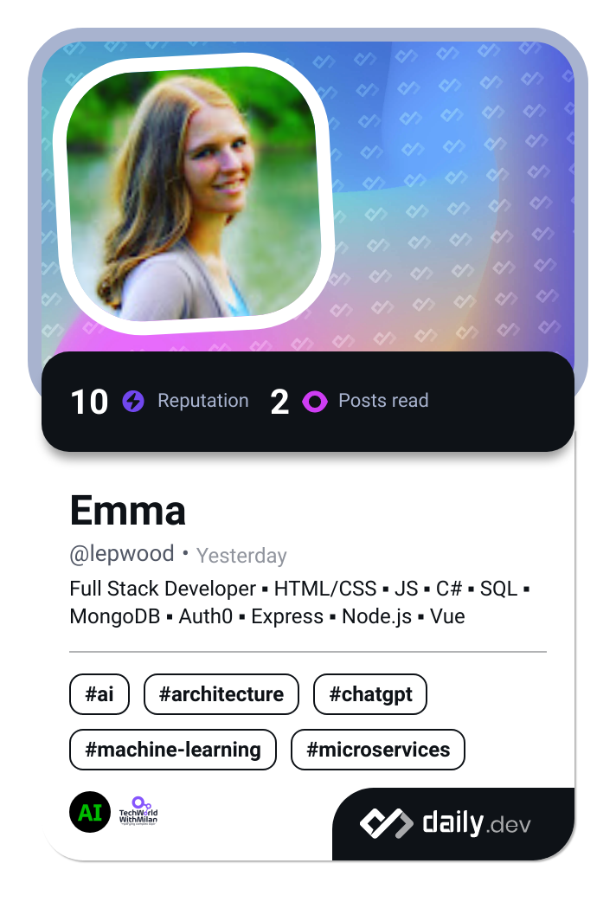

<h1 align="center">Hello, I'm Emma Wood</h1>

<b>Web Developer:</b> <a href="https://ewood-coder.github.io/EmmaPortfolioBootstrap/">Portfolio</a>
 

- 👀 I’m interested in coding (web design specifically) 👩‍💻, video games 🎮, and being the best homebody I can be 🏠.
- 🌱 Recent graduate from Boise Codeworks. Also a graduate from CWI with an associates in software development (2022).
- 💞️ I’m looking to collaborate on just about anything if I can contribute what I know.
- 📫 How to reach me: 
&nbsp;&nbsp;&nbsp;&nbsp;&nbsp;&nbsp;- <b>Phone:</b> (208)-908-2162 
&nbsp;&nbsp;&nbsp;&nbsp;&nbsp;&nbsp;- <b>Email:</b> emmawood.coding@gmail.com 

<b>My Languages & Frameworks:</b>
 

<!---
ewood-coder/ewood-coder is a ✨ special ✨ repository because its `README.md` (this file) appears on your GitHub profile.
You can click the Preview link to take a look at your changes.
--->
