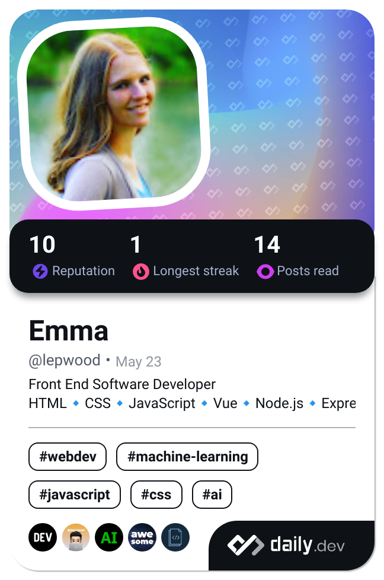

- 👋 Hi, I’m @ewood-coder (or Emma)!
- 👀 I’m interested in coding (web design specifically), video games, and being the best homebody I can be.
- 🌱 Recent graduate from Boise Codeworks. Also a graduate from CWI with an associates in software development (2022).
- 💞️ I’m looking to collaborate on just about anything if I can contribute what I know.
- 📫 How to reach me: Phone: (208)-908-2162,  Email: emmawood.coding@gmail.com

<!---
ewood-coder/ewood-coder is a ✨ special ✨ repository because its `README.md` (this file) appears on your GitHub profile.
You can click the Preview link to take a look at your changes.
--->
